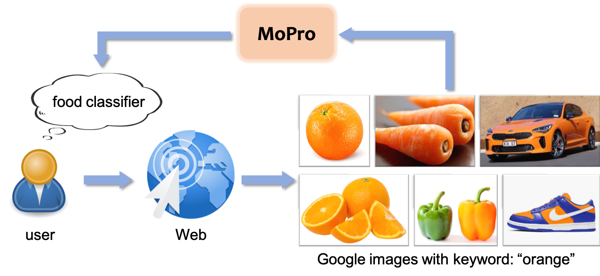

## MoPro: Webly Supervised Learning with Momentum Prototypes (Salesforce Research)

This is a PyTorch implementation of the <a href="https://openreview.net/forum?id=0-EYBhgw80y">MoPro paper</a> (<a href="https://blog.einstein.ai/mopro-webly-supervised-learning-with-momentum-prototypes/">Blog post</a>):
<pre>
@article{MoPro,
	title={MoPro: Webly Supervised Learning with Momentum Prototypes},
	author={Junnan Li and Caiming Xiong and Steven C.H. Hoi},
	journal={ICLR},
	year={2021}
}</pre>

### Requirements:
* <a href="https://data.vision.ee.ethz.ch/cvl/webvision/download.html">WebVision dataset</a>
* ImageNet dataset (for evaluation)
* Python ≥ 3.6
* PyTorch ≥ 1.4

### Training
This implementation currently only supports multi-gpu, DistributedDataParallel training, which is faster and simpler.

To perform webly-supervised training of a ResNet-50 model on WebVision V1.0 using a 4-gpu or 8-gpu machine, run: 
<pre>python train.py \ 
  --data [WebVision folder] \ 
  --exp-dir experiment/MoPro\
  --dist-url 'tcp://localhost:10001' --multiprocessing-distributed --world-size 1 --rank 0
</pre>

### Download MoPro Pre-trained ResNet-50 Models
<a href="https://storage.googleapis.com/sfr-pcl-data-research/MoPro_checkpoint/MoPro_V1_epoch90.tar">WebVision V1</a>| <a href="https://storage.googleapis.com/sfr-pcl-data-research/MoPro_checkpoint/MoPro_V2_epoch90.tar">WebVision v2</a>
------ | ------

### Noise Cleaning
<pre>python noise_cleaning.py --data [WebVision folder] --resume [pre-trained model path] --annotation pseudo_label.json
</pre>

### Classifier Retraining on WebVision
<pre>python classifier_retrain.py --data [WebVision folder] --imagenet [ImageNet folder]\ 
  --resume [pre-trained model path] --annotation pseudo_label.json --exp-dir experiment/cRT\
  --dist-url 'tcp://localhost:10001' --multiprocessing-distributed --world-size 1 --rank 0 
</pre>

### Fine-tuning on ImageNet (1% of labeled data)
<pre>python finetune_imagenet.py \
  --data [ImageNet path] \
  --model-path [pre-trained model path] \
  --exp-dir experiment/Finetune \
  --low-resource 0.01 \
  --dist-url 'tcp://localhost:10001' --multiprocessing-distributed --world-size 1 --rank 0 
</pre>

Result for WebVision-V1 pre-trained model: 
Percentage | 1% | 10% 
------ | ------ | ------
Accuracy | 71.2 | 74.8 

### Linear SVM Evaluation on VOC or Places
<pre>python lowshot_svm.py --model_path [your pretrained model] --dataset VOC --voc-path [VOC data path]
</pre>

Result for WebVision-V1 pre-trained model: 
VOC| k=1 | k=2 | k=4 | k=8 | k=16
--- | --- | --- | --- | --- | --- 
mAP| 59.5| 71.3| 76.5| 81.4| 83.7

Places| k=1 | k=2 | k=4 | k=8 | k=16
--- | --- | --- | --- | --- | --- 
Acc| 16.9| 23.2| 29.2| 34.5| 38.7
